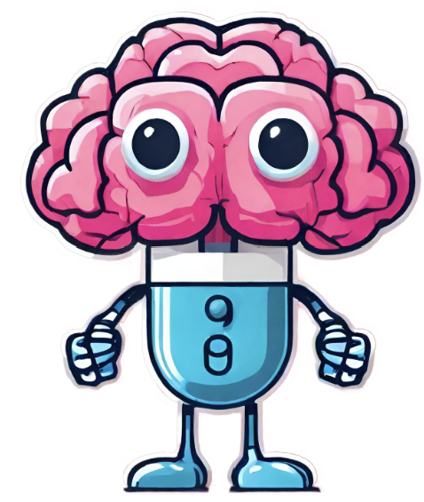

## QueryMind 
By: Orayda Shagifa, Kenda Najjar, Paula Magbor and Taleen Alkadah

## Inspiration 🤔
As students, we've often faced challenges with understanding course content and trying to seek out resources like additional practice questions without breaking the bank. This personal struggle inspired us to create QueryMind, a web application that helps enhance student's comprehension. 

 

## What it does ⚙️
QueryMind allows users to provide personal learning materials (i.e. notes) that they would like to review. Then, the user can input their inquiries about the material, ask for a summary of the content or request practice questions to help consolidate their learning. By tailoring this information to user-specified material, this approach can help students supplement their learning and streamline their revision of concepts relevant to their course material within in larger subject area. 
[Click here for the demo video!](https://drive.google.com/file/d/1236j0btYxA7TZPHg3v2wwyYG8gO8MxLE/view?usp=sharing)

## How we built it 🐱‍💻
We made the front end with HTML and the back end with Python, making use of OpenAI for the chat functionality. To merge the two, we used Flask. Lastly, we generated the logo using generative AI.

## Challenges we ran into 😤
As this was our first project integrating back-end and front-end components, we faced many challenges linking the two components with Flask. However, with the assistance of friendly mentors and personal research into documentation and other sources, we were able to resolve syntax and logical issues we had and got the program to run. We also faced challenges trying to set up the AI API workspace initially.

## Accomplishments that we're proud of 🥹
We are proud of our teamwork and the new skills we learned to actualize this idea. This project was a catalyst for us to get more exposure to front-end programming languages and how to use Flask and other new tools to connect both ends.

## What we learned 💡
Through this project, we learned how to use OpenAI and Flask. We also got some insight into the process of connecting frontend and backend and exposure to other approaches we are keen to implement for future hackathons and personal projects, such as using Django and React. 

## What's next for QueryMind? ➡️
The main features we would like to integrate into QueryMind are:
* Increasing the tool's capacity to take larger files (for instance, splitting the file into smaller chunks
* Supporting a broader range of file types
* Enhancing UI and UX elements of the web application to make it more accessible (i.e. auditory functionality, dark mode, click and drag upload)

